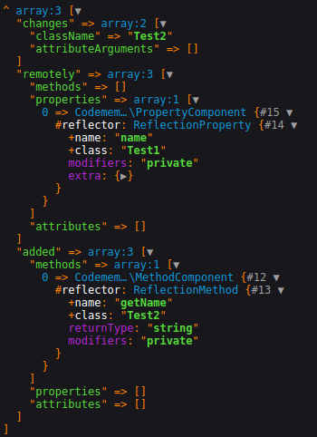

# Object comparison

> Данный пакет сравнивает 2 объекта и возвращает результат сравнения. 

## В сравнение входит
- [x] Имя класса
- [x] Атрибуты
- [x] Аргументы атрибутов
- [x] Свойства
- [x] Методы

## Установка

```
composer require codememory/object-comparison
```

## Примеры использования

```php
<?php

use Codememory\Components\ObjectComparison\ObjectComparison;

require_once 'vendor/autoload.php';

class Test1 
{

    /**
     * @var string|null 
     */
    private ?string $name = null;

}

class Test2
{

    /**
     * @return string
     */
    private function getName(): string
    {
    
        return 'Codememory';
    
    }

}

$objectComparison = new ObjectComparison(new Test1(), new Test2());

var_dump($objectComparison->getComparisonResult());
```
## Результат сравнения
